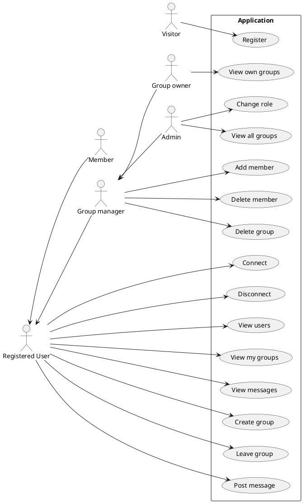
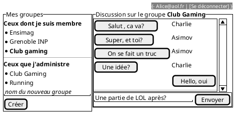

---
title: Projet React 
author:  
- Ahmed Boudahmane, Mamadou Thiongane
--- 

## Cahier des charges

### Cas d'usage

A modifier/compléter 



### Maquettes

#### Forumulaire de connexion


#### Gestion des groupes


#### Gestion des messages



### Captures d'écran

#### Forumulaire de connexion


#### Gestion des groupes


#### Gestion des messages


### API mise en place

Lien vers la documentation swagger : https://web-application.osc-fr1.scalingo.io/doc/

## Architecture du code

### FrontEnd

```sh
frontend/src
|-- App.css
|-- App.jsx
|-- AppContext.js
|-- assets
|   `-- logo.svg
|-- components
|   |-- Button.jsx
|   |-- ErrorMessage.jsx
|   |-- GroupManager.jsx
|   |-- GroupMessages.jsx
|   |-- Groups.jsx
|   |-- InputField.jsx
|   |-- ListGroups.jsx
|   |-- ListMembers.jsx
|   |-- ListMessages.jsx
|   |-- LoginForm.jsx
|   |-- MemberManager.jsx
|   `-- RegisterForm.jsx
|-- index.css
|-- main.jsx
`-- views
    |-- Accueil.jsx
    `-- LoginView.jsx
```

### Backend

#### Schéma de votre base de donnée

```plantuml
class User{
  name
  email
  passhash
  isAdmin : boolean
}

class Message{
  content
}

class Group{
  name
}

User "1" -- "n" Message : posts
Group "1" -- "n" Message : contains

User "n" -- "n"  Group : is member 
User "1" -- "n"  Group : create and own
```

#### Architecture de votre code

```sh
backend/src
|-- __tests__
|   `-- api.test.js
|-- app.js
|-- controllers
|   |-- groups.js
|   |-- messages.js
|   `-- user.js
|-- frontend
|   `-- index.html
|-- models
|   |-- database.js
|   |-- groups.js
|   |-- messages.js
|   `-- users.js
|-- routes
|   |-- groups.js
|   |-- messages.js
|   |-- router.js
|   `-- user.js
|-- server.js
`-- util
    |-- CodeError.js
    |-- logger.js
    |-- swagger.js
    `-- updatedb.js
```

#### Obtention d'un token d'accès

```js
fetch("http://localhost:3000/login", {
  "method": "POST",
  "headers": {
    "content-type": "application/json"
  },
  "body": {
    "email": "John.Doe@acme.com",
    "password": "1m02P@SsF0rt!"
  }
})
.then(response => {
  console.log(response);
})
.catch(err => {
  console.error(err);
});
```

### Gestion des rôles et droits

Expliquer ici les différents rôles mis en place, et comment ils sont gérés dans votre code.

- Coté backend

- Coté frontend

## Test

### Backend

Décrivez les tests faits au niveau du backend, leur couverture.

### Frontend

Décrivez les tests faits au niveau du backend, leur couverture.

## Intégration + déploiement (/3)

Décrivez ici les éléments mis en place au niveau de l'intégration continue 

## Installation

```sh
cd frontend; npm install; npm run dev #frontend
commande # pour lancer les tests frontend
cd backend; npm install; npm run start #backend
commande # pour lancer les tests backend ?
firefox https://xxx.scalingo.ioscalingo/docs # pour accéder à la doc scalingo si déployé en ligne
```
