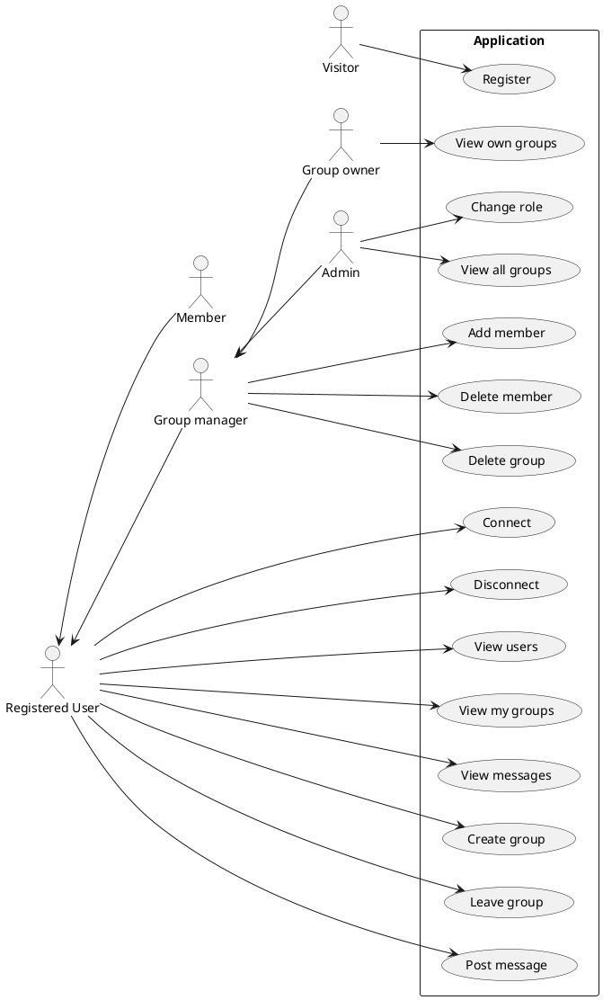
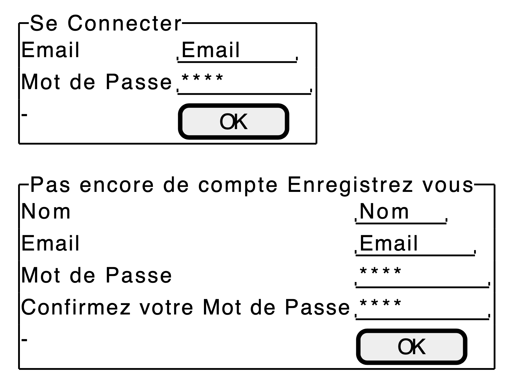
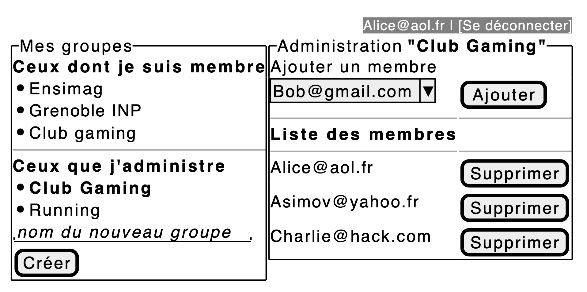
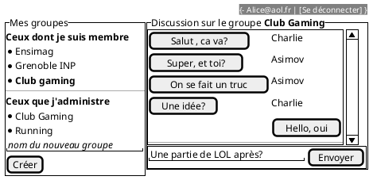
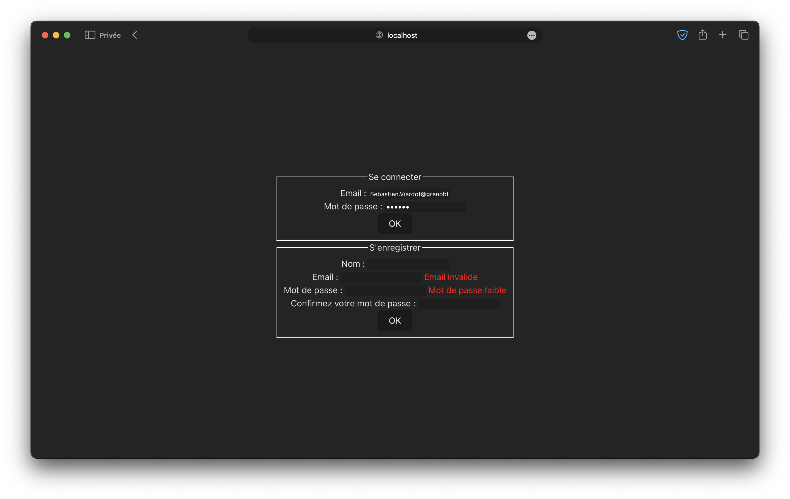
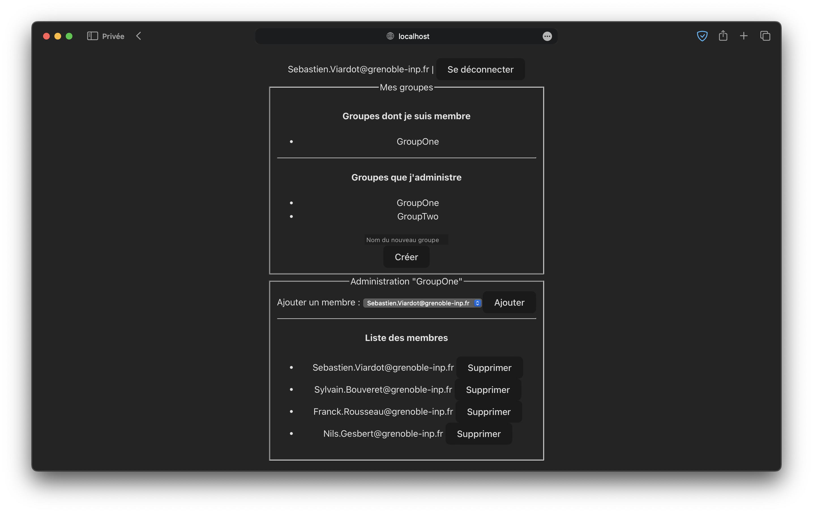
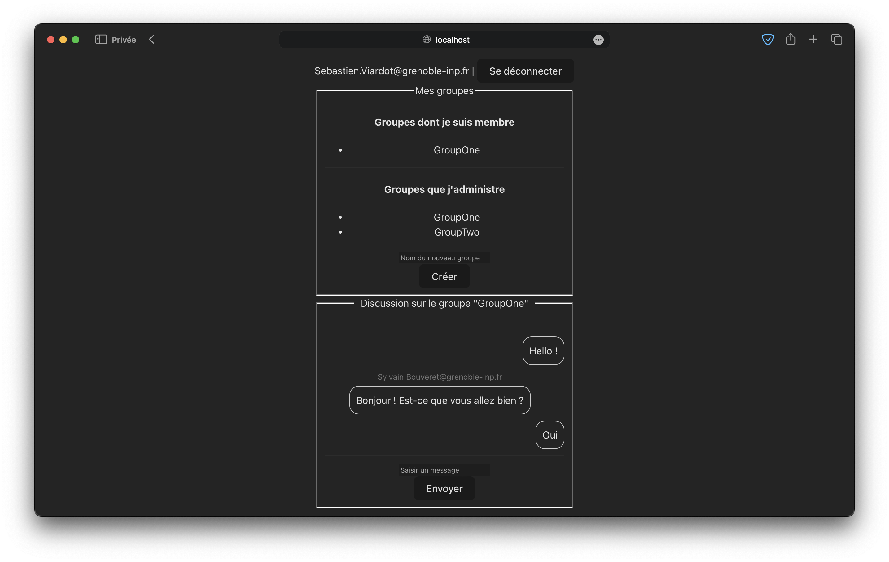

---
title: Projet React 
author:  
- Ahmed Boudahmane, Mamadou Thiongane
--- 

## Cahier des charges

### Cas d'usage



### Maquettes

#### Formulaire de connexion



#### Gestion des groupes



#### Gestion des messages



### Captures d'écran

#### Formulaire de connexion



#### Gestion des groupes



#### Gestion des messages



### API mise en place

Lien vers la documentation swagger : https://web-application.osc-fr1.scalingo.io/doc/

## Architecture du code

### FrontEnd

```sh
frontend/src
|-- App.css
|-- App.jsx
|-- AppContext.js # Contexte
|-- assets
|   `-- logo.svg # Un logo
|-- components
|   |-- Button.jsx # Boutons
|   |-- ErrorMessage.jsx # Champs pour les messages d'erreur
|   |-- GroupManager.jsx # Ajout de membre
|   |-- GroupMessages.jsx # Gestion des messages (envoi, ...)
|   |-- Groups.jsx # Gestion des groupes (création, ...)
|   |-- InputField.jsx # Champs de saisie
|   |-- ListGroups.jsx # Liste des groupes
|   |-- ListMembers.jsx # Liste des membres
|   |-- ListMessages.jsx # Liste des messages
|   |-- LoginForm.jsx # Formulaire de connexion
|   |-- MemberManager.jsx # Suppression de membre
|   `-- RegisterForm.jsx # Formulaire d'enregistrement
|-- index.css
|-- main.jsx
`-- views
    |-- Accueil.jsx # Page d'accueil
    `-- LoginView.jsx # Page de connexion
```

### Backend

#### Schéma de votre base de donnée

```plantuml
class User{
  name
  email
  passhash
  isAdmin : boolean
}

class Message{
  content
}

class Group{
  name
}

User "1" -- "n" Message : posts
Group "1" -- "n" Message : contains

User "n" -- "n"  Group : is member 
User "1" -- "n"  Group : create and own
```

#### Architecture de votre code

```sh
backend/src
|-- __tests__
|   `-- api.test.js
|-- app.js
|-- controllers
|   |-- groups.js
|   |-- messages.js
|   `-- user.js
|-- frontend
|   `-- index.html
|-- models
|   |-- database.js
|   |-- groups.js
|   |-- messages.js
|   `-- users.js
|-- routes
|   |-- groups.js
|   |-- messages.js
|   |-- router.js
|   `-- user.js
|-- server.js
`-- util
    |-- CodeError.js
    |-- logger.js
    |-- swagger.js
    `-- updatedb.js
```

#### Obtention d'un token d'accès

```js
fetch("https://web-application.osc-fr1.scalingo.io/login", {
  "method": "POST",
  "headers": {
    "content-type": "application/json"
  },
  "body": {
    "email": "John.Doe@acme.com",
    "password": "1m02P@SsF0rt!"
  }
})
.then(response => {
  console.log(response);
})
.catch(err => {
  console.error(err);
});
```

### Gestion des rôles et droits

#### Backend

Les différentes rôles mis en place sont : utilisateur, membre d'un groupe, propriétaire d'un groupe et administrateur.

Les rôles sont gérés par des *middleware* implémentés dans les fichiers du répertoire `backend/src/controllers`.

#### Frontend

Les rôles précédents sont gérées à l'aide d'un contexte (`frontend/src/AppContext.js`) définissant plusieurs variables (token, login) à partir d'appels au backend.

Les fonctionnalités des administrateurs sont incomplètes (suppression d'un groupe et changement de rôle non implémentés).

## Test

### Backend

Des tests Jest sont faits au niveau du backend avec une couverture de 100%.

```sh
cd backend
npm install
npm run test
```

### Frontend

Des tests Cypress sont faits au niveau du frontend (formulaire de connexion et gestion des groupes). Ces tests sont indépendants du backend grâce à l'interception des requêtes réseau. Les fixtures se trouvent dans le répertoire `frontend/cypress/fixtures`.

```sh
cd frontend
npm install
npm run dev &
npx cypress run
```

## Intégration + déploiement (/3)

Éléments mis en place :
- eslint
- sonarqube
- semgrep-security
- api-test (tests backend)
- cypress (tests frontend)
- scalingo (déploiement du backend)
- pages (déploiement de l'application)
- génération de badges

## Installation

```sh
cd backend
npm install
npm run start
firefox  https://web-application.osc-fr1.scalingo.io # pour accéder à la doc scalingo
```

```sh
cd frontend
npm install
npm run dev &
firefox http://localhost:5173 # pour accéder à l'application
```

## Accès à l'application

Lien de l'application : https://tp5-6-backend-react-ahmed-boudahmane-mamadou-thi-2b3c5d404a9c87.pages.ensimag.fr/
